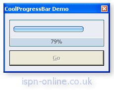



## Aqua Progress Bar

### Description

Aqua style progress bar for use in your applications. Includes option for 4 built in skins, and a custom user defined skin. Complete colour customisation, font selection etc. Votes appreciated.
 
### More Info
 

             |
---                |---
**Submitted On**   |2003-06-24 12:46:28
**By**             |[ByteForce UK](https://github.com/Planet-Source-Code/PSCIndex/blob/master/ByAuthor/byteforce-uk.md)
**Level**          |Intermediate
**User Rating**    |4.7 (99 globes from 21 users)
**Compatibility**  |VB 5\.0, VB 6\.0
**Category**       |[Custom Controls/ Forms/  Menus](https://github.com/Planet-Source-Code/PSCIndex/blob/master/ByCategory/custom-controls-forms-menus__1-4.md)
**World**          |[Visual Basic](https://github.com/Planet-Source-Code/PSCIndex/blob/master/ByWorld/visual-basic.md)
**Archive File**   |[Aqua\_Progr1605616252003\.zip](https://github.com/Planet-Source-Code/byteforce-uk-aqua-progress-bar__1-46429/archive/master.zip)

